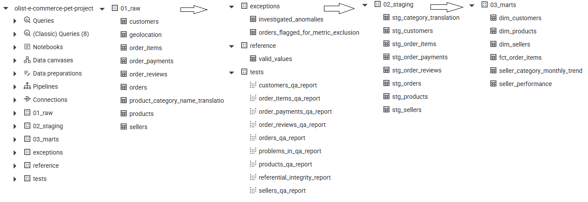

# Seller Performance & Revenue Analytics

An end-to-end analytics project built on the Brazilian E-Commerce Public Dataset by Olist.

The project covers the full analytical workflow from raw data validation and staging to analytical marts and an interactive Tableau dashboard focused on seller performance, GMV dynamics, seller lifecycle, and identification of sellers requiring further investigation.

> **Tools:** BigQuery · SQL · Tableau  
> **Dataset:** Brazilian E-Commerce Public Dataset by Olist

---

## Dashboard

**[View the interactive Tableau dashboard](https://public.tableau.com/views/Olist_sellers_dashboard/SellerPerformanceRevenue?:language=en-GB&:sid=&:redirect=auth&:display_count=n&:origin=viz_share_link)**


The dashboard allows users to select a **base month** from the latest six complete months and compare its performance with the previous month.

---

## Business Problem

The goal of the project was to build an analytical view that could help a business team:

- monitor overall GMV and order activity;
- identify categories contributing to changes in GMV;
- understand which seller segments drive MoM changes;
- monitor the seller lifecycle;
- identify individual sellers with significant performance declines;
- provide a practical starting point for further investigation by customer support or account management teams.

The dashboard is designed not only to report metrics, but also to help move from an aggregated business signal to a specific seller requiring investigation.

---

# Data & Architecture

The source dataset contains information about:

- orders;
- order items;
- payments;
- reviews;
- products;
- customers;
- sellers;
- product category translations.

The analytical pipeline consists of four main layers:

```text
Raw Data
   ↓
Data Quality Checks
   ↓
Staging Layer
   ↓
Analytical Marts
   ↓
Tableau Dashboard
```

---

# 1. Data Quality & Validation

Before building analytical tables, I performed data quality checks across the raw tables.

Each source table has its own validation view, plus a consolidated view containing only detected issues.

The checks cover:

- NULL and missing values;
- invalid or non-positive values;
- duplicate identifiers;
- temporal inconsistencies;
- referential integrity;
- unexpected relationships between tables;
- inconsistencies between related monetary fields.

### Examples of detected issues


| Table / Check | Result | Investigation / Treatment |
|---|---|---|
| `order_payments` — installment values | 2 anomalies | Investigated as known dataset anomalies; payment amount matched `order_items` |
| `order_reviews` — duplicate `review_id` | 789 rows | `review_id` was not unique; a unique key was introduced in staging |
| `order_reviews` — multiple reviews per order | 547 orders | Multiple reviews can exist for one order; the latest review was retained in staging |
| `order_reviews` — review before order | 63 rows | Investigated as a timestamp/system anomaly; source values were retained and flagged |
| `orders` — carrier delivery before approval | 1,359 rows | Investigated as a known dataset anomaly and flagged in staging |
| `orders` — customer delivery before carrier delivery | 23 rows | Investigated and flagged in staging |
| `products` — missing category | 610 rows | Missing categories were handled in staging |
| `products` — invalid weight | 6 rows | Zero values were converted to NULL |
| `products` — missing dimensions | 2 rows | Investigated and retained with missing values |
| `products` — missing photo count | 610 rows | Handled as missing source data |
| `orders → order_items` referential integrity | 775 orders | Corresponds to undelivered orders without order-item records in the analytical context |
| `orders → order_payments` referential integrity | 1 order | Delivered order without payment details; flagged as an anomaly |
| `products → category translation` | 623 rows | Missing translations were mapped to `Uncategorized`; two category translations were added manually |
| `order_items / payments` mismatch | 13 rows | Investigated possible causes; `order_items` was used as the monetary source of truth |

The purpose of these checks was not to blindly remove anomalous records, but to **distinguish actual data-quality problems from known source-data behavior** and document how each case was handled.

<!-- SCREENSHOT: Insert a screenshot of the consolidated data-quality issues table -->
<!-- Suggested file: /images/data_quality_checks.png -->

---

# 2. Staging Layer

After validation, staging tables were created to standardize the source data and make downstream analysis safer.

Key transformations included:

### Reviews

- retained the latest review for each order;
- introduced a unique review key;
- added a `valid_review` field;
- for seller-level analysis, reviews were considered valid only for orders associated with a single seller.

### Products

- handled missing product attributes;
- added translated product categories;
- introduced `Uncategorized` for products without a category translation.

### Orders and Order Items

Problematic source records were not silently deleted.

Where appropriate, anomalies were preserved and explicitly flagged in staging tables so that their impact could be traced.

> In a production environment, large fact tables such as `orders` and `order_items` would also benefit from partitioning. This was not implemented because partitioning is restricted in the BigQuery sandbox environment used for this project.

---

# 3. Analytical Marts

Several marts were created for different analytical use cases. More marts were developed than were ultimately required by the dashboard.

### Main Tableau marts

#### `seller_category_monthly_trend`

Monthly seller/category-level aggregation used for:

- GMV trends;
- category performance;
- seller lifecycle analysis;
- monthly seller activity.

#### `seller_performance`

Seller-level lifetime and current-period metrics used for the detailed seller table and seller investigation.

The dashboard-facing tables were deliberately prepared at an analytical grain suitable for Tableau rather than relying on complex calculations inside the visualization layer.

---

# 4. Additional Analytical Features

Two additional analytical concepts were introduced specifically for the dashboard.

## Seller Lifecycle

A simplified monthly seller lifecycle model was created:

| Lifecycle | Definition |
|---|---|
| **New** | First order occurs in the current month |
| **Retention** | Seller had sales in both the previous and current month |
| **React** | Seller had no sales in the previous month but returned in the current month |
| **Churn** | Seller has no sales in the current month |

Churn is not materialized as a separate monthly row for inactive sellers. This avoids repeatedly storing inactive sellers for every subsequent month.

This is a simplified model intended to demonstrate how a production lifecycle classification could be implemented.

## Seller Ranking

Seller lifetime GMV was used to assign sellers into relative importance groups:

- Top 100
- Top 200
- Top 300
- Top 500
- 500+

There are 3,073 sellers in the dataset.

The ranking allows the dashboard to identify whether overall GMV changes are concentrated among the most important sellers without exposing individual lifetime sales values directly in the visualization.

---

# 5. Tableau Dashboard

The dashboard is designed around a selected **base month**.

The available base month can be selected from the latest six complete months. The source dataset ends on September 3, 2018, so the latest complete month available in the dashboard is August 2018.

<!-- SCREENSHOT: Insert the complete dashboard here -->
<!-- Suggested file: /images/dashboard_full.png -->

## KPI Overview

The dashboard contains three main KPIs for the selected base month:

- **GMV**
- **Order Count**
- **Seller Count**

Each KPI includes:

- current value;
- MoM change;
- MoM percentage change.

A six-month trend line provides historical context.

The base month can also be changed directly through the trend visualization.


---

## GMV by Category

A monthly/category comparison shows GMV performance for the base month versus the previous month.

The visualization includes:

- base-month GMV;
- previous-month GMV;
- MoM percentage change;
- an indicator for categories with declining GMV.

This helps identify which categories contribute to the overall movement in GMV.


---

## MoM GMV by Seller Rank

A waterfall chart shows how different seller-rank groups contributed to the overall MoM GMV change.

This makes it possible to distinguish between:

- broad-based performance changes;
- changes concentrated among high-value sellers;
- changes primarily driven by lower-ranked sellers.


---

## Seller Lifecycle

Monthly active sellers are segmented by lifecycle:

- New
- React
- Retention

The chart shows both seller counts and MoM changes for each lifecycle segment.

This provides context for understanding whether changes in active seller count are driven by acquisition, returning sellers, or retained sellers.


---

## Seller-Level Investigation

The final table contains all sellers, including inactive sellers.

Available fields include:

- Seller ID
- Seller rank
- Lifetime ranking
- Review count
- First order date
- Last order date
- Days since first order
- Days since last order
- Base month
- Seller lifecycle in the base month
- Base-month GMV
- Previous-month GMV
- MoM GMV change
- MoM GMV change %

The table is sorted by **MoM GMV change**, making sellers with the largest declines immediately visible.

Inactive sellers are marked as **Churn**.


---

# 6. Example Analysis — August 2018

The August 2018 view demonstrates how the dashboard can be used to move from an aggregated business signal to an individual seller.

At the overall level:

- the number of active sellers increased;
- order activity increased;
- GMV nevertheless declined slightly.

The seller-rank analysis showed that the largest contribution to the decline came from the **Top 100 and Top 200 sellers**.

The seller-level table then made it possible to identify individual sellers responsible for the largest declines.

### Example 1 — High-value seller

The seller with the largest GMV decline among the Top 100 had:

- five consecutive active months before August;
- an unusually strong July;
- no sales in August.

This pattern suggests that the seller should be investigated by a customer-support or account-management team rather than interpreted immediately as permanent churn.

### Example 2 — Top 200 seller

The second-largest decline came from a Top 200 seller who had been active for only three months, with the first sale recorded in June 2018.
Although the seller's GMV declined in August 2018, July had been an unusually strong month compared with June and August. Given the seller's short activity history, there is not yet enough evidence to establish a consistent sales pattern or classify the seller as being at risk of churn.

This case illustrates why **a significant MoM decline should be treated as a signal for further investigation, rather than an immediate indication of churn.**

---

# 7. From Monitoring to Further Action

The dashboard is intentionally designed as the first stage of an investigation.

Once a problematic seller segment is identified, the resulting list could be passed to a customer-support, account-management, or commercial team for further analysis.

Depending on the company's operating model, additional fields could be introduced, for example:

- account-management status;
- risk indicators;
- recent support contacts;
- operational issues;
- category-specific benchmarks;
- predefined action flags.

This would turn the dashboard from a monitoring tool into part of a broader seller-retention workflow.

---

# 8. Data Model

The project uses a layered analytical approach:

```text
RAW
│
├── orders
├── order_items
├── order_payments
├── order_reviews
├── products
├── customers
├── sellers
└── product_category_translation
        │
        ▼
DATA QUALITY CHECKS
        │
        ▼
STAGING
│
├── stg_orders
├── stg_order_items
├── stg_order_reviews
├── stg_products
└── ...
        │
        ▼
ANALYTICAL MARTS
│
├── seller_category_monthly_trend
├── seller_performance
└── ...
        │
        ▼
TABLEAU
```



---

# 9. Repository Structure

The repository contains the SQL used to build and validate the analytical layer.

Suggested structure:

```text
.
├── README.md
│
├── sql/
│   ├── 01_data_quality/
│   │   ├── valid_values_table.sql
│   │   ├── orders_qa_report.sql
│   │   ├── customers_qa_report.sql
│   │   ├── order_items_qa_report.sql
│   │   ├── order_payments_qa_report.sql
│   │   ├── order_reviews_qa_report.sql
│   │   ├── products_qa_report.sql
│   │   ├── sellers_qa_report.sql
│   │   ├── referential_integrity_report.sql
│   │   ├── investigated_anomalies_table.sql
│   │   └── orders_flagged_for_metric_exclusion_table.sql
│   │
│   ├── 02_staging/
│   │   ├── staging_tables.sql
│   │
│   └── 03_marts/
│       ├── mart_tables.sql
│
├── media/
│   ├──...

```

The exact filenames can be adjusted to match the repository.

---

# 10. Key Technical Decisions

### Data quality before analysis

Raw data was validated before being used for analytical calculations. Detected anomalies were investigated and classified rather than automatically removed.

### Explicit staging layer

Business logic and data cleaning were separated from the final analytical marts.

### Traceable anomaly handling

Where source-data anomalies were retained, they were flagged rather than silently modified.

### Tableau-ready marts

The main dashboard calculations were prepared in BigQuery at an appropriate analytical grain to keep the Tableau layer focused on visualization and interaction.

### Business-oriented segmentation

Seller lifecycle and seller ranking were introduced to make aggregated performance changes actionable.

### Investigation workflow

The dashboard was designed to support a path from:

```text
Overall KPI
    ↓
Category / Seller Segment
    ↓
Seller-level performance
    ↓
Specific seller for investigation
```

---

# 11. Tools

| Tool | Purpose |
|---|---|
| **BigQuery** | Data storage, validation, transformation and analytical marts |
| **SQL** | Data quality checks, staging and analytical transformations |
| **Tableau** | Interactive visualization and dashboard |
| **Git / GitHub** | Version control and project documentation |

---

# 12. Dataset

This project uses the **Brazilian E-Commerce Public Dataset by Olist**.

The dataset contains anonymized information about orders, customers, sellers, products, payments, reviews, and product categories.

**Source:** [Olist Brazilian E-Commerce Public Dataset](https://www.kaggle.com/datasets/olistbr/brazilian-ecommerce/data?select=olist_order_items_dataset.csv)

---

# 13. Dashboard Link

**[Open the interactive Tableau Public dashboard](https://public.tableau.com/views/Olist_sellers_dashboard/SellerPerformanceRevenue?:language=en-GB&:sid=&:redirect=auth&:display_count=n&:origin=viz_share_link)**

<!-- GIF: Optional — a 10–20 second GIF showing the dashboard interaction is useful here -->
<!-- Suggested content:
     1. Change the base month
     2. Show the KPI update
     3. Select/filter a seller
     4. Show the seller-level investigation
-->

---

## Project Outcome

The project demonstrates an end-to-end analytics workflow:

**Raw data → Data quality validation → Staging → Analytical marts → Tableau dashboard → Business investigation**

Rather than treating the dashboard as the final output, the project focuses on building a reliable analytical layer and using it to identify concrete business signals that can be investigated further.